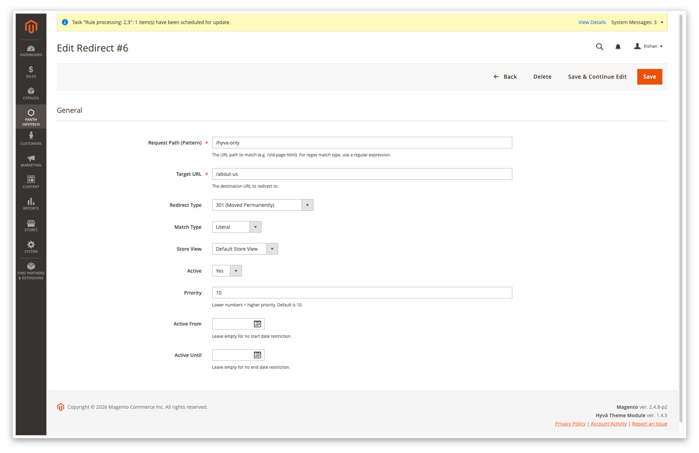
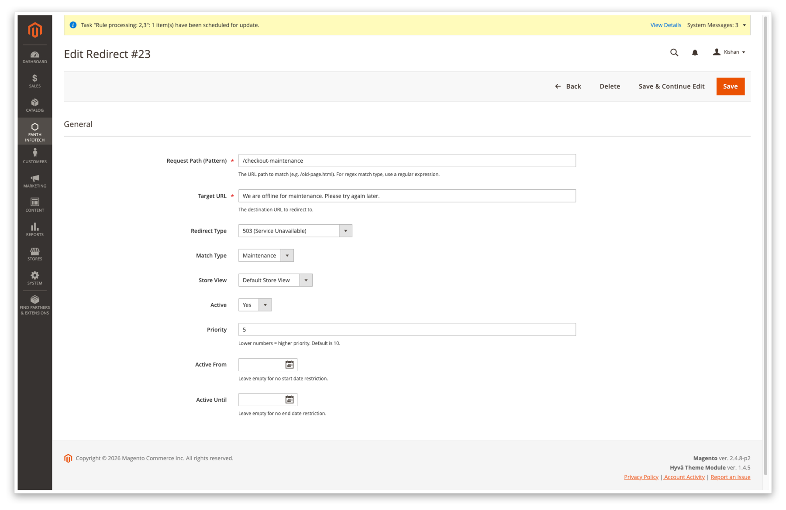
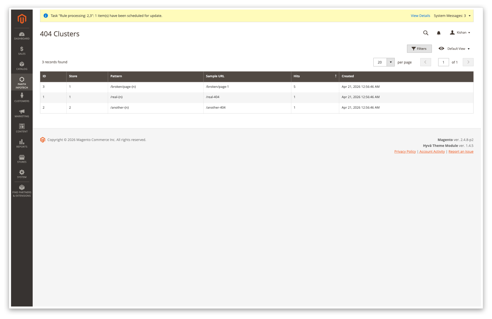

<!-- SEO Meta -->
<!--
  Title: Panth Redirects - 301/302 Redirects and 404 Logger for Magento 2
  Description: Complete URL redirect management for Magento 2 (Hyva + Luma). Manual + auto redirects on product/category/CMS delete, bulk CSV import/export, scheduled cleanup, 404 logger with cluster analysis for redirect recommendations. Extracted from Panth_AdvancedSEO for independent installation.
  Keywords: magento 2 redirects, magento 301 redirect, magento 404 logger, magento bulk redirect import, magento redirect cleanup, magento auto redirect on delete, hyva redirects, luma redirects
  Author: Kishan Savaliya (Panth Infotech)
-->

# Panth Redirects - 301/302 Redirects and 404 Logger for Magento 2 (Hyva + Luma)

[](https://magento.com)
[](https://php.net)
[]()
[](https://packagist.org/packages/mage2kishan/module-redirects)
[](https://hyva.io)
[]()
[](https://www.upwork.com/freelancers/~016dd1767321100e21)
[](https://www.upwork.com/agencies/1881421506131960778/)
[](https://kishansavaliya.com)

> **Complete redirect and 404 management for Magento 2.** Manual and auto
> redirects, bulk CSV import/export, scheduled cleanup, 404 logger and
> cluster analysis that surfaces redirect recommendations. Works identically
> on **Hyva** and **Luma**.

---

## Screenshots

### Redirects grid — at-a-glance rule management


Colour-coded status codes, sortable columns, per-row hit counter,
scheduling windows and in-grid filters. Import CSV / Export CSV / Add
Redirect are one click away.

### Edit Redirect — full status-code picker

<table>
  <tr>
    <td></td>
    <td></td>
  </tr>
  <tr>
    <td align="center"><sub>Literal 301 redirect</sub></td>
    <td align="center"><sub>Maintenance mode → HTTP 503</sub></td>
  </tr>
</table>

The Redirect Type dropdown offers every supported HTTP code:
**301, 302, 303, 307, 308, 410, 451** and **503**. Pattern, target,
store scope, active toggle, priority and scheduling are all editable
per-rule.

### CSV Import — bulk-load with a downloadable template


Upload a header-first CSV to bulk-import redirects. A **Download sample
CSV** link emits a ready-to-edit template with one row per supported
match type so the column order and value shape are obvious.

### 404 Log — every unmatched URL


Per-store log of every path that did not match a catalogue entry or a
redirect rule. Referer, user-agent and hit count are de-duplicated on
`(store_id, sha256(path))` so a flood of 404s can never saturate the
table. A suggested target column is populated by the clustering cron.

### 404 Clusters — find the pattern behind the noise



The clustering cron walks the last seven days of 404 hits, collapses
`/broken/page-1`, `/broken/page-2`, … into `/broken/page-{n}` and writes
the top offenders with sample URLs, so a single redirect rule can clean
up an entire family of dead links.

---

## Features

- **Redirect grid** with literal, regex and maintenance (503) match types,
  priority, scheduling (Active From / Active Until), hit counter and
  per-store scoping.
- **Auto-create 301 on delete** for products, categories and CMS pages.
  Target can be the parent category, homepage or a per-store custom URL -
  validated against open-redirect and path-traversal at write time.
- **CSV import / export** with loop detection, formula-injection stripping,
  dangerous-URI-scheme blocklist and configurable dry-run mode.
- **CLI import** for deployments: `bin/magento panth:redirects:import
  file.csv [--dry-run]`.
- **404 logger** with per-IP rate limit (APCu when available; per-worker
  fallback otherwise), de-duplicated by `(store_id, sha256(path))`.
- **404 cluster cron** that aggregates the last seven days of logged 404s
  by normalised pattern and writes the top offenders to the cluster table.
- **Redirect cleanup cron** that deletes expired scheduled redirects and
  auto-generated rules that have never been hit.
- **Homepage / lowercase / trailing-slash redirect plugins**, all
  frontend-only, routed through a central `RedirectGuard` that drops any
  AJAX, non-GET, admin, API or asset request before a redirect is issued.

---

## Compatibility

| Platform    | Versions        |
|-------------|-----------------|
| Magento OSS | 2.4.4 - 2.4.8   |
| Adobe Commerce | 2.4.4 - 2.4.8 |
| PHP         | 8.1, 8.2, 8.3, 8.4 |
| Themes      | Hyva, Luma      |

Requires `mage2kishan/module-core` >= 1.0 (Panth Infotech menu tab).

---

## Installation

```bash
composer require mage2kishan/module-redirects
bin/magento setup:upgrade
bin/magento setup:di:compile
bin/magento cache:flush
```

---

## Admin URLs

| Page                  | URL path                                  |
|-----------------------|-------------------------------------------|
| Redirects grid        | `/admin/panth_redirects/redirect/index`   |
| New redirect          | `/admin/panth_redirects/redirect/edit`    |
| CSV import            | `/admin/panth_redirects/redirect/importPage` |
| 404 Log               | `/admin/panth_redirects/notfoundlog/index` |
| 404 Clusters          | `/admin/panth_redirects/notfoundcluster/index` |
| Configuration         | *Stores > Configuration > Panth > Redirects & 404s* |

---

## Configuration

| Path                                                | Default |
|-----------------------------------------------------|---------|
| `panth_redirects/general/enabled`                   | 1       |
| `panth_redirects/general/auto_redirect_enabled`     | 1       |
| `panth_redirects/general/redirect_target_strategy`  | parent_category |
| `panth_redirects/general/redirect_custom_url`       | (empty) |
| `panth_redirects/general/lowercase_redirect`        | 1       |
| `panth_redirects/general/homepage_redirect`         | 1       |
| `panth_redirects/general/remove_trailing_slash`     | 0       |
| `panth_redirects/general/expiry_days`               | 365     |
| `panth_redirects/logging/log_404`                   | 1       |
| `panth_redirects/logging/rate_limit_per_second`     | 10      |

---

## Security

- Admin controllers all extend `Magento\Backend\App\Action` so FormKey
  validation, ACL and authentication are enforced by the framework.
- Every request parameter is cast to an expected type and compared against
  an explicit allow-list before it reaches the database layer.
- All DB queries use parameter placeholders or `Zend_Db_Expr` - no
  user-controlled string concatenation anywhere in the redirect or 404
  code paths.
- Regex patterns are compiled with `@preg_match` inside try/catch so a bad
  rule only logs a warning and is skipped; it can never crash the store.
- CSV import validates extension, MIME type and size, uses `fgetcsv()` on
  a file handle (never `str_getcsv` on a raw body), strips leading
  formula-injection characters (`= + - @ \t \r`), rejects dangerous URI
  schemes in the target column and runs loop detection before inserting.
- 404 log entries go through `escapeHtml()` in the admin grid so an
  attacker-submitted referer or user-agent can never execute script on
  an admin's browser.
- 404 logger is rate-limited per IP so a flood of 404s can never saturate
  the log table.

---

## License

Proprietary. Commercial licence required for use in production.
