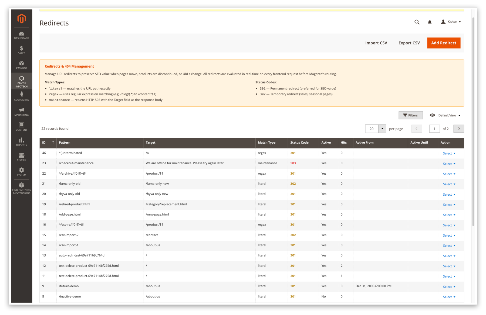
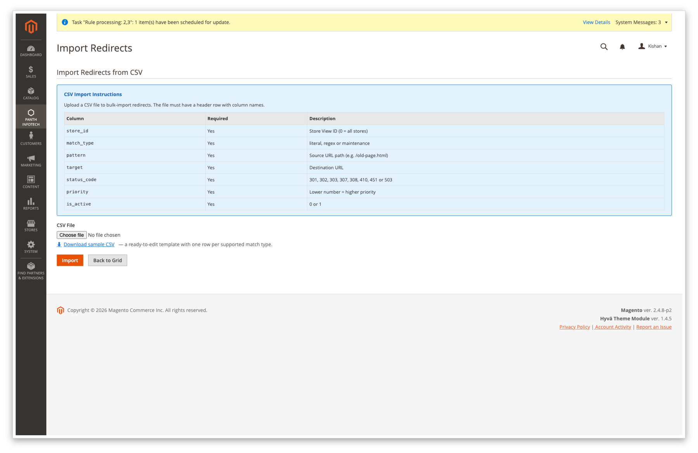
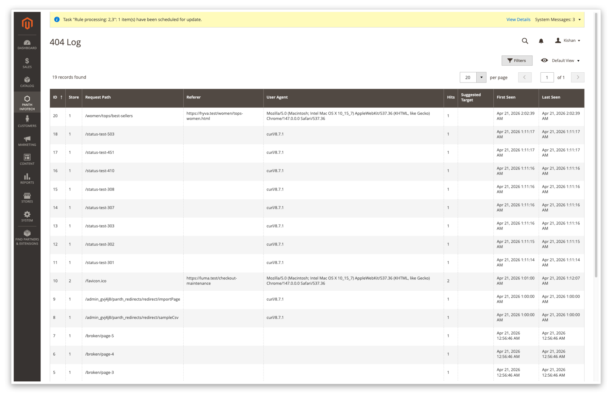

<!-- SEO Meta -->
<!--
  Title: Panth Redirects — 301/302 Redirects & 404 Logger for Magento 2 (Hyva + Luma)
  Description: Complete URL redirect management for Magento 2. Manual + auto 301s on product/category/CMS delete, full HTTP status-code support (301, 302, 303, 307, 308, 410, 451, 503), bulk CSV import/export with loop detection, scheduled cleanup, 404 logger with per-IP rate limiting and cluster analysis for redirect recommendations. Works identically on Hyva and Luma. Extracted from Panth_AdvancedSEO for standalone installation.
  Keywords: magento 2 redirects, magento 301 redirect, magento 302 redirect, magento 410 gone, magento 451 legal redirect, magento 503 maintenance mode, magento bulk redirect import, magento csv redirect export, magento 404 logger, magento 404 cluster analysis, magento auto redirect on delete, hyva redirects, luma redirects, magento redirect scheduling, magento redirect priority, magento redirect cleanup cron
  Author: Kishan Savaliya (Panth Infotech)
-->

# Panth Redirects — 301/302 Redirects & 404 Logger for Magento 2 (Hyva + Luma)

[](https://magento.com)
[](https://php.net)
[](https://hyva.io)
[]()
[](https://packagist.org/packages/mage2kishan/module-redirects)
[](https://www.upwork.com/freelancers/~016dd1767321100e21)
[](https://kishansavaliya.com)
[](https://kishansavaliya.com/get-quote)

> **Complete redirect and 404 management for Magento 2.** Declare a literal or regex rule in the admin, or let the module auto-create a 301 the moment a product, category or CMS page is deleted. Every URL request is checked against the Matcher before Magento's own routing, so live redirects never 404 first. Bulk-load rules from CSV with loop detection, export them back, schedule a cleanup cron, and let the 404 logger + cluster analyser surface the dead-link patterns that actually need a redirect. Works identically on **Hyva** and **Luma**.

Redirect hygiene is one of the highest-leverage on-site SEO signals a store owns — but in native Magento it lives across three different places (catalog URL rewrites, CMS URL rewrites, `.htaccess`) and has no 404 visibility at all. **Panth Redirects** unifies it in a single admin surface with full HTTP status-code coverage, CSV tooling, and the observability needed to keep the rule set clean as the catalogue churns.

---

## Need Custom Magento 2 Development?

<p align="center">
  <a href="https://kishansavaliya.com/get-quote">
    
  </a>
</p>

<table>
<tr>
<td width="50%" align="center">

### Kishan Savaliya
**Top Rated Plus on Upwork**

[](https://www.upwork.com/freelancers/~016dd1767321100e21)

</td>
<td width="50%" align="center">

### Panth Infotech Agency

[](https://www.upwork.com/agencies/1881421506131960778/)

</td>
</tr>
</table>

---

## Table of Contents

- [Preview](#preview)
- [Features](#features)
- [How It Works](#how-it-works)
- [Supported HTTP Status Codes](#supported-http-status-codes)
- [Compatibility](#compatibility)
- [Installation](#installation)
- [Configuration](#configuration)
- [Managing Redirects](#managing-redirects)
- [CSV Import / Export](#csv-import--export)
- [404 Log & Cluster Analysis](#404-log--cluster-analysis)
- [Security](#security)
- [Troubleshooting](#troubleshooting)
- [Support](#support)

---

## Preview

### Live walkthrough

End-to-end admin flow — land on the dashboard, open **Panth Infotech → Manage Redirects**, add a rule, save, import a CSV, review the 404 log and the 404 cluster view.


### Admin

**Redirects grid** — every rule at a glance with colour-coded status codes, match type, store scope, per-row hit counter and scheduling window. Import CSV, Export CSV, and Add Redirect are one click away.



**Edit form — Literal 301** — map `/hyva-only` to `/about-us` at store-view scope with priority 10 and no scheduling restriction.


**Edit form — Maintenance 503** — serve `We are offline for maintenance. Please try again later.` with HTTP 503 + `Retry-After: 3600` when the match fires. The **Redirect Type** dropdown offers the full set of supported codes.


**CSV Import** — upload a header-first CSV to bulk-import redirects. A **Download sample CSV** link emits a ready-to-edit template with one row per supported match type so the column order and value shape are obvious before you upload.



**404 Log** — every unmatched URL, de-duplicated by `(store_id, sha256(path))`, with referer, user-agent, hit count and first/last-seen timestamps.



**404 Clusters** — the clustering cron walks the last seven days of 404 hits, collapses `/broken/page-1`, `/broken/page-2`, … into `/broken/page-{n}` and writes the top offenders with sample URLs so a single redirect rule can clean up an entire family of dead links.


---

## Features

| Feature | Description |
|---|---|
| **Three match types** | `literal` (exact path), `regex` (with back-reference expansion into the target), and `maintenance` (returns HTTP 503 with the Target field as the response body). |
| **Full HTTP status code picker** | 301, 302, 303, 307, 308, 410, 451, 503 — all eight codes are shared by the admin form, the Save validator, and the CSV importer via one source model. |
| **Smart dispatcher** | 3xx codes emit a proper `Location` header; 410/451 serve the status + body without a bogus redirect; 503 adds `Retry-After: 3600`. |
| **Auto-create 301 on delete** | Product, category and CMS page deletes trigger a 301 rule pointing to parent-category / homepage / admin-configured custom URL. Each target is validated against open-redirect and path-traversal at write time. |
| **CSV import / export** | Loop detection, formula-injection stripping, dangerous-URI-scheme blocklist, validated match types and status codes, dry-run mode. |
| **CLI import** | `bin/magento panth:redirects:import file.csv [--dry-run]` for deployment pipelines. |
| **404 logger** | Per-IP rate limit (APCu when available; per-worker fallback otherwise), de-duplicated on `(store_id, sha256(path))`. Referer and user-agent are escaped on render so a hostile value can never XSS an admin. |
| **404 cluster cron** | Aggregates seven days of 404 traffic by normalised pattern and writes the top offenders — pick a cluster, create one regex rule, clear the long tail. |
| **Redirect cleanup cron** | Deletes expired scheduled redirects and auto-generated rules that have never been hit. Admin-curated rows are never removed. |
| **Per-store scoping** | `store_id = 0` rules apply everywhere; non-zero rules are scoped to a specific store view. |
| **Priority** | Lower numbers win when two literal rules share the same normalised pattern. |
| **Scheduling** | Optional `Active From` / `Active Until` per rule — ideal for seasonal sales or planned migrations. |
| **RedirectGuard** | Every request is vetted first: non-GET, AJAX, admin, API (`/rest/`, `/soap/`, `/graphql`), and static-asset prefixes (`/static/`, `/media/`) are skipped before the Matcher runs. |
| **Mass actions** | Enable, disable or delete many rules at once from the grid. |

---

## How It Works

Six cooperating pieces:

1. **Redirects grid** at `panth_redirects/redirect/index` — standard UI-component listing backed by the `panth_seo_redirect` table with the colour-coded status-code column.
2. **Admin form** at `panth_redirects/redirect/edit/id/<ID>` — `Match Type` switches between Literal / Regex / Maintenance; `Redirect Type` is populated from `Panth\Redirects\Model\Config\Source\StatusCode`, the single source of truth for allowed codes.
3. **`Matcher`** — two-tier lookup. Tier 1 is a hash table for literal paths (O(1)). Tier 2 is a priority-ordered regex list (linear). Loaded once per request, cached in Magento cache under tag `panth_redirects_table`, invalidated on rule save / import / cron.
4. **`Predispatch` observer** on `controller_action_predispatch` — consults the Matcher *before* Magento dispatches the controller, so live redirects never cause a 404 first. Branches on the status code: 3xx → `setRedirect()`, 4xx/5xx → `setStatusHeader()` + body.
5. **`NoRoute` observer + `NoRouteHandler` plugin** — log every unmatched path to `panth_seo_404_log`, but consult the Matcher first so a path that is about to redirect is never counted as a 404.
6. **Two crons** — `panth_redirects_404_cluster` (daily) aggregates 404s into cluster patterns; `panth_redirects_redirect_cleanup` (weekly) deletes expired scheduled rules and stale auto-generated rows.

---

## Supported HTTP Status Codes

| Code | Behavior | Typical use |
|------|----------|-------------|
| **301** | Moved Permanently — `Location` header emitted | Permanent URL change (preferred for SEO value). |
| **302** | Found (Temporary) — `Location` header emitted | Short-lived promos, seasonal pages. |
| **303** | See Other — `Location` header emitted | Force the client to re-issue a GET after a POST. |
| **307** | Temporary Redirect — `Location` header, method preserved | Preserve POST/PUT semantics for a temporary move. |
| **308** | Permanent Redirect — `Location` header, method preserved | Permanent move that must keep POST semantics. |
| **410** | Gone — status + body, **no** `Location` | Product retired with no replacement — tells search engines to drop the URL. |
| **451** | Unavailable For Legal Reasons — status + body | Geo-blocked or legally-takendown content. |
| **503** | Service Unavailable — status + body + `Retry-After: 3600` | Short maintenance windows. Same as setting Match Type = Maintenance. |

---

## Compatibility

| Requirement | Supported |
|---|---|
| Magento Open Source | 2.4.4, 2.4.5, 2.4.6, 2.4.7, 2.4.8 |
| Adobe Commerce | 2.4.4 — 2.4.8 |
| PHP | 8.1, 8.2, 8.3, 8.4 |
| Hyva Theme | 1.0+ (fully compatible) |
| Luma Theme | Native support |
| Panth Core | ^1.0 (installed automatically) |

---

## Installation

```bash
composer require mage2kishan/module-redirects
bin/magento module:enable Panth_Core Panth_Redirects
bin/magento setup:upgrade
bin/magento setup:di:compile
bin/magento cache:flush
```

### Verify

```bash
bin/magento module:status Panth_Redirects
# Module is enabled
```

Visit **Admin → Panth Infotech → Manage Redirects** to see the empty grid.

---

## Configuration

Navigate to **Stores → Configuration → Panth Infotech → Redirects & 404s**.

| Setting | Path | Default | What it controls |
|---|---|---|---|
| **Enable module** | `panth_redirects/general/enabled` | Yes | Master switch. No rules fire and no 404s are logged when this is off. |
| **Enable auto-redirect on delete** | `panth_redirects/general/auto_redirect_enabled` | Yes | When a product / category / CMS page is deleted, insert a 301 pointing to the configured target. |
| **Auto-redirect target strategy** | `panth_redirects/general/redirect_target_strategy` | `parent_category` | `parent_category`, `homepage`, or `custom_url`. |
| **Auto-redirect custom URL** | `panth_redirects/general/redirect_custom_url` | (empty) | Used when the strategy is `custom_url`. Validated against open-redirect and path-traversal. |
| **Lowercase URL redirect** | `panth_redirects/general/lowercase_redirect` | Yes | Redirects `/FOO` to `/foo`. |
| **Homepage alias redirect** | `panth_redirects/general/homepage_redirect` | Yes | Redirects `/home`, `/index.html` etc. to `/`. |
| **Remove trailing slash** | `panth_redirects/general/remove_trailing_slash` | No | Strips trailing `/` on non-root URLs via 301. |
| **Auto-rule expiry (days)** | `panth_redirects/general/expiry_days` | 365 | Auto-generated rules that never hit are deleted after this many days by the cleanup cron. Admin-curated rows are never removed. |
| **Log 404s** | `panth_redirects/logging/log_404` | Yes | Write to `panth_seo_404_log`. |
| **404 rate limit (per second)** | `panth_redirects/logging/rate_limit_per_second` | 10 | Per-IP ceiling on 404 log writes. |

Each setting is resolved at *store-view* scope, so link budgets, auto-redirect targets and 404 logging can differ per store.

---

## Managing Redirects

Open **Admin → Panth Infotech → Manage Redirects** to reach the grid.

### Fields

| Field | Description |
|---|---|
| **Request Path (Pattern)** | The URL path to match. For `regex`, a PCRE pattern (unwrapped — the engine adds delimiters). |
| **Target URL** | Destination for 3xx codes, or the response body for 410/451/503. Relative paths (`/about-us`) and absolute URLs (`https://other-host.example/`) both work. External hosts must be in the store's `base_url`. |
| **Redirect Type** | HTTP status code. See [Supported HTTP Status Codes](#supported-http-status-codes). |
| **Match Type** | `literal`, `regex` or `maintenance`. |
| **Store View** | `0` = all stores; a non-zero value scopes the rule to one store view. |
| **Active** | Per-row toggle. |
| **Priority** | Lower number wins when two literal rules share the same normalised pattern. |
| **Active From / Active Until** | Optional scheduling window. Leave empty for no restriction. |

### Mass actions

Select rows and choose **Enable**, **Disable** or **Delete** from the grid mass-action menu.

---

## CSV Import / Export

### Header

```csv
store_id,match_type,pattern,target,status_code,priority,is_active
```

### Example

```csv
store_id,match_type,pattern,target,status_code,priority,is_active
0,literal,/old-page.html,/new-page.html,301,10,1
1,literal,/hyva-only-old,/hyva-only-new,301,20,1
2,literal,/luma-only-old,/luma-only-new,302,20,1
0,regex,^/archive/([0-9]+)$,/product/$1,301,30,1
0,maintenance,/checkout-maintenance,"We are offline for maintenance. Please try again later.",503,5,1
```

Click **Download sample CSV** on the Import page to grab this exact template.

### CLI import

```bash
bin/magento panth:redirects:import file.csv            # live import
bin/magento panth:redirects:import file.csv --dry-run  # validate only, no DB writes
```

Every row is validated against:

- `match_type ∈ {literal, regex, maintenance}`
- `status_code ∈ {301, 302, 303, 307, 308, 410, 451, 503}`
- `pattern` non-empty; regexes must compile
- `target` rejected if it uses `javascript:`, `data:` or `vbscript:` schemes
- Literal rules run the loop detector — a chain that points back at itself is skipped with an error, never persisted

### Export

**Export CSV** on the grid streams every rule (respecting any active filters) through the ImportExport service's `exportToStream` method.

---

## 404 Log & Cluster Analysis

### 404 Log

Every request that doesn't match a catalogue entry, a CMS page *or* a redirect rule is written to `panth_seo_404_log`. Rows are de-duplicated by `(store_id, sha256(path))` so a crawler hammering the same URL just increments `hit_count` instead of writing N rows. Referer and user-agent are stored for attribution and escaped at render time.

Per-IP rate limiting uses **APCu** when the extension is available (shared counter across FPM workers) and falls back to a per-worker static when it isn't — so the logger can never saturate the table under a DoS-y flood of 404s.

### 404 Clusters

The `panth_redirects_404_cluster` cron runs once a day. It walks the last seven days of `panth_seo_404_log`, groups paths by a normalised pattern (digits → `{n}`, UUIDs → `{uuid}`, slug segments collapsed when cardinality is high) and writes the top 500 clusters to `panth_seo_404_cluster`. From the admin grid you can see the hit count + a sample URL, then create one `regex` redirect rule that cleans up the entire family.

---

## Security

- Admin controllers extend `Magento\Backend\App\Action`. Every CRUD path declares its own `ADMIN_RESOURCE` constant and ACL is enforced via `_isAllowed()`.
- `Save`, `MassDelete`, `MassStatus` and `Import` implement `HttpPostActionInterface` — GET is rejected. Form-key validation runs on every POST.
- Every request parameter is cast to an expected type and compared against an explicit allow-list (match type, status code) before it reaches the database layer.
- All DB queries use parameter placeholders or `Zend_Db_Expr`. No user-controlled string concatenation in the redirect or 404 code paths.
- Regex rules are compiled with `@preg_match` wrapped in `try / catch`. A malformed rule logs a warning and is skipped; it can never crash the storefront.
- CSV import validates extension, MIME type, file size, reads via `fgetcsv()` on a file handle (never `str_getcsv` on a raw body), strips formula-injection characters (`= + - @ \t \r`) at the head of every cell, rejects dangerous URI schemes in the target column and runs loop detection before inserting.
- 404 log entries are escaped with `escapeHtml()` in the admin grid, so an attacker-submitted referer / user-agent can never execute script on an admin's browser.
- External redirect targets are only permitted if the host matches one of the configured store `base_url` values. Open-redirect to an arbitrary domain is blocked at dispatch time.
- `RedirectGuard` drops non-GET, AJAX, admin, API and static-asset requests before the Matcher even runs — so redirects only apply to actual storefront navigations.

---

## Troubleshooting

### A rule is live in the grid but the frontend still 404s

1. `bin/magento cache:clean config full_page` — the Matcher caches the compiled rule table under `panth_redirects_table` and re-reads on next request.
2. Confirm **Enable module** is Yes at the store-view scope you are browsing.
3. Confirm the rule's **Active** flag is Yes.
4. If you use **Active From / Active Until**, make sure *now* falls within the window.
5. Test with a plain `curl` GET — `curl -k -o /dev/null -w '%{http_code} → %{redirect_url}\n' https://your-store.test/old-path`. If the HTTP response is the expected 3xx/4xx/5xx, your browser is just caching the old 404; hard-refresh.

### `curl -I` returns 404 but a plain GET redirects correctly

That is intentional. `RedirectGuard` allows GET only — HEAD/POST/PUT are skipped on purpose so the redirect engine can't interfere with API and form-post flows.

### 410 / 451 responses still send a `Location` header

Make sure you are running ≥ 1.0.1. Earlier releases always called `setRedirect()`; 1.0.1+ branches on status code and emits `setStatusHeader()` + body (no `Location`) for 4xx/5xx rules.

### Two literal rules share the same pattern and the wrong one wins

Fixed in 1.0.1 — the Matcher now keeps the first row returned by the DB (sorted `priority ASC, redirect_id ASC`) and refuses to let a higher-priority-number row overwrite it in the in-memory hash. Upgrade and flush cache.

### 404 log is recording successful redirects

Fixed in 1.0.1 — both the `cms_index_noroute` observer and the `NoRouteHandlerInterface::process` plugin now consult the Matcher first and skip logging when a redirect rule is about to fire. Upgrade.

### 404 log grows too fast

Lower `panth_redirects/logging/rate_limit_per_second`. If you are being crawled aggressively, also install APCu so the rate limiter uses a shared counter instead of the per-worker fallback.

---

## Support

- **Agency:** [Panth Infotech on Upwork](https://www.upwork.com/agencies/1881421506131960778/)
- **Direct:** [kishansavaliya.com](https://kishansavaliya.com) — [Get a free quote](https://kishansavaliya.com/get-quote)
