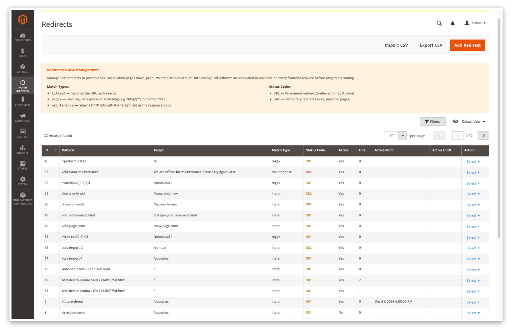
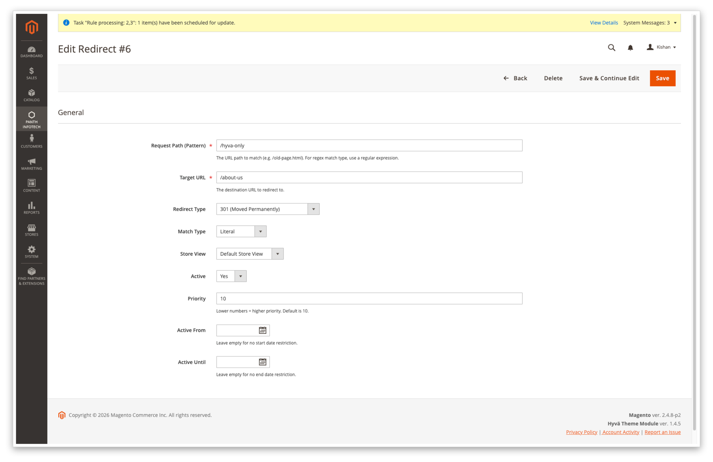
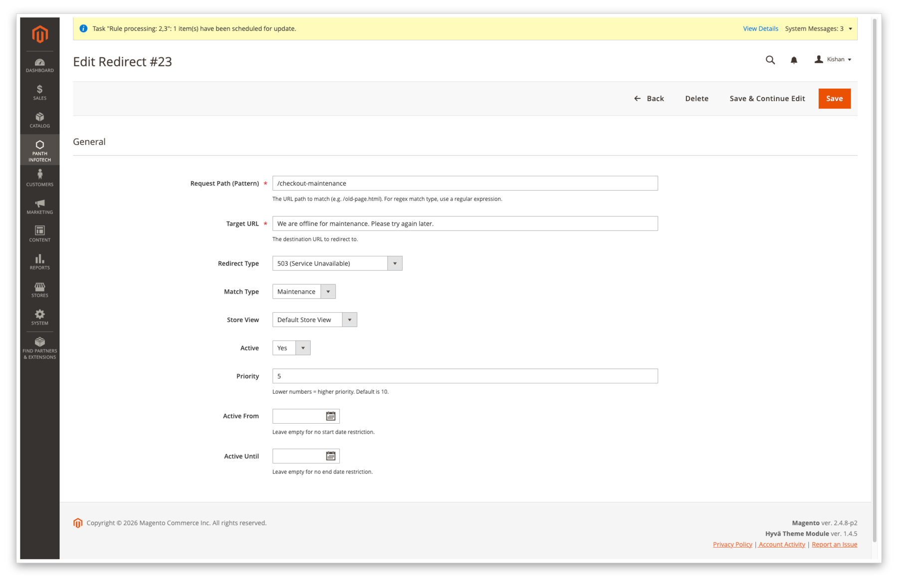
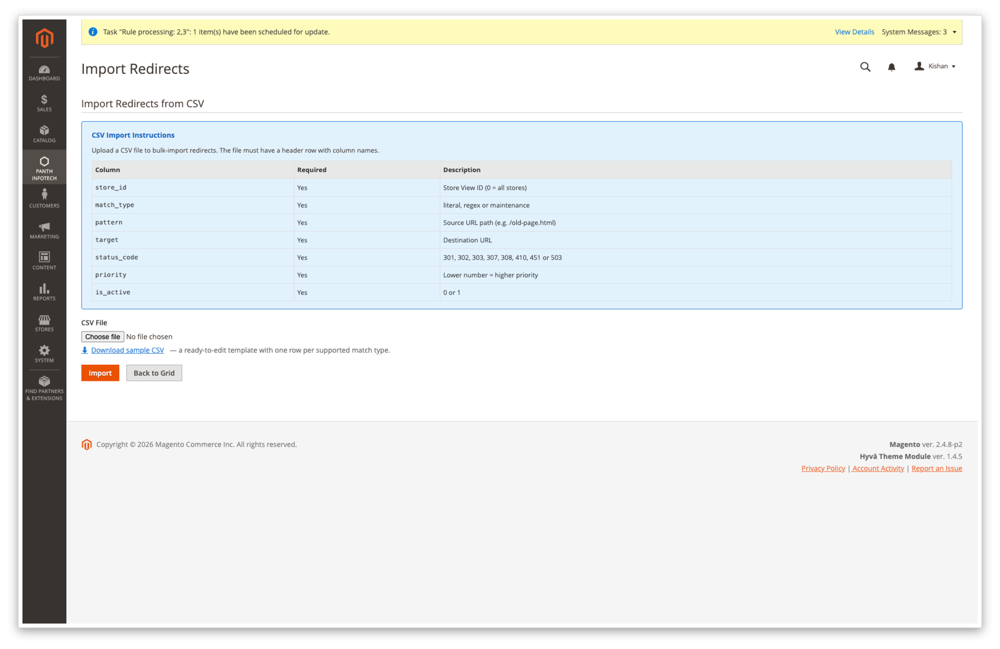
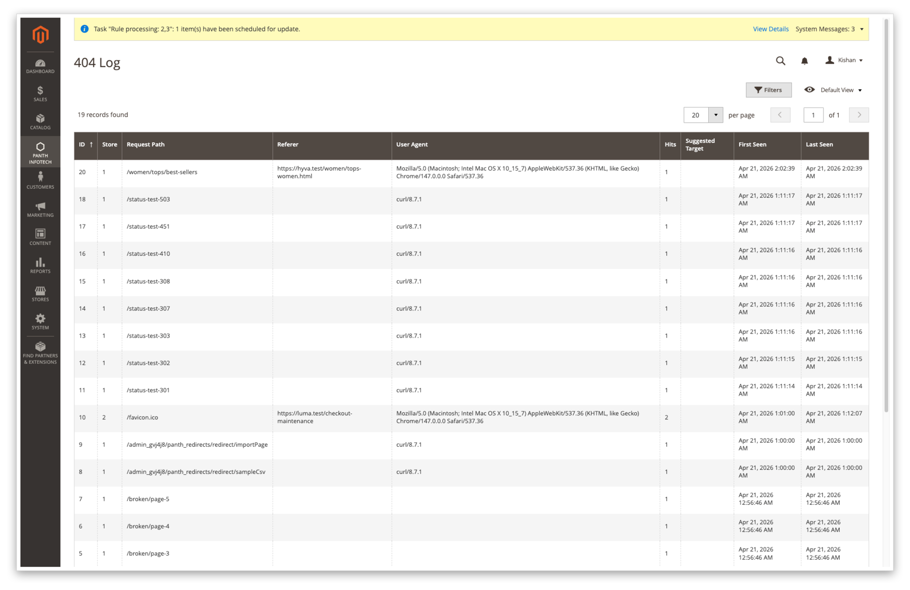
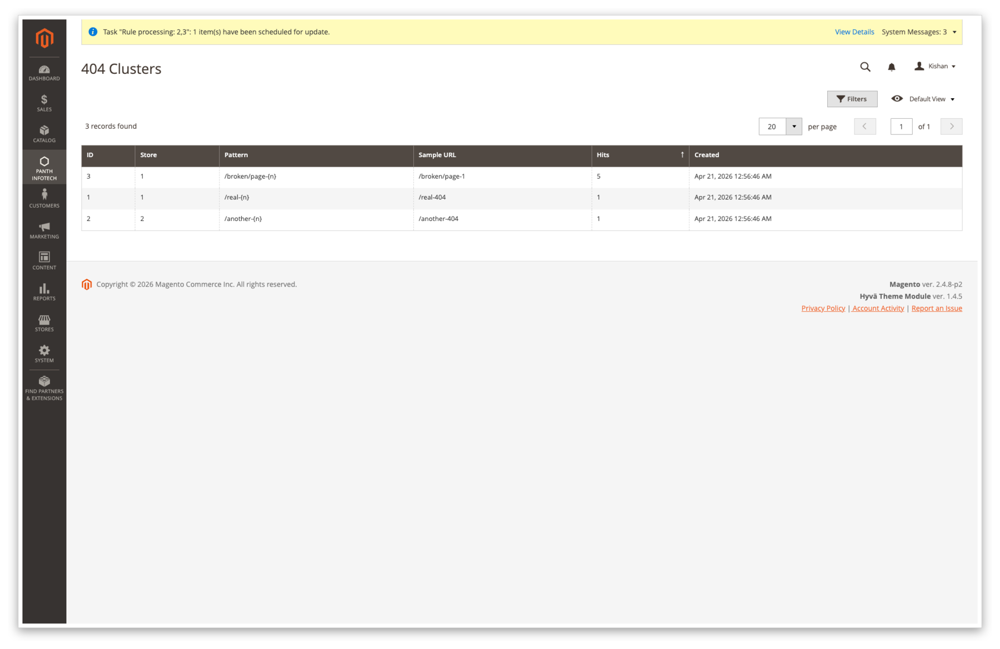

<!-- SEO Meta -->
<!--
  Title: Magento 2 Redirects Extension: 301/302 Redirect Manager, 404 Logger & Cluster Analysis | Hyva + Luma | Panth Infotech
  Description: Panth Redirects adds a full redirect manager to Magento 2 with literal, regex, and maintenance rules, auto-301 on product/category/CMS delete, bulk CSV import/export with loop detection, scheduled cleanup cron, and a 404 logger with cluster analysis to surface dead-link patterns. Works on Hyva and Luma. Built by Top Rated Plus Magento developer Kishan Savaliya.
  Keywords: magento 2 redirects, magento 2 redirect manager, magento 2 301 redirect, magento 2 302 redirect, magento 2 410 gone, magento 2 404 logger, magento 2 bulk redirect import, magento 2 csv redirect export, magento 2 404 cluster analysis, magento 2 auto redirect on delete, hyva redirects, luma redirects, magento 2 regex redirect, magento 2 url redirect module, magento 2 redirect scheduling
  Author: Kishan Savaliya (Panth Infotech)
  Canonical: https://kishansavaliya.com/magento-2-redirects.html
-->

# Magento 2 Redirects Extension: Redirect Manager, 404 Logger and Cluster Analysis (Hyva + Luma)

[](https://magento.com)
[](https://php.net)
[](https://www.hyva.io)
[](https://kishansavaliya.com/magento-2-redirects.html)
[](https://packagist.org/packages/mage2kishan/module-redirects)
[](https://www.upwork.com/freelancers/~016dd1767321100e21)
[](https://kishansavaliya.com)

> **Manage all your Magento 2 redirects from one admin screen.** Panth Redirects handles literal path rules, regex patterns, maintenance pages, and auto-301s on product/category/CMS delete. It logs every 404, groups them into clusters so you can write one rule to fix a whole family of dead links, and ships bulk CSV import/export with loop detection. Works identically on **Hyva** and **Luma**.

**Product page:** [kishansavaliya.com/magento-2-redirects.html](https://kishansavaliya.com/magento-2-redirects.html)

---

## Quick Answer

**What is Panth Redirects?** It is a Magento 2 redirect management extension that replaces scattered `.htaccess` entries and catalog URL rewrite tables with a single admin grid. You create literal, regex, or maintenance rules and the module fires them before Magento's own routing so a live redirect never returns a 404 first.

**What does it add to my store?**

- A **redirect manager grid** with support for eight HTTP status codes: 301, 302, 303, 307, 308, 410, 451, and 503.
- **Auto-301 on delete** so removing a product, category, or CMS page automatically inserts a redirect pointing to the parent category, homepage, or a custom URL.
- **Bulk CSV import/export** with loop detection, formula-injection stripping, and a CLI dry-run mode.
- A **404 logger** that de-duplicates hits by path hash and rate-limits per IP to protect the log table.
- A **404 cluster view** that groups seven days of dead-link traffic by URL pattern so you can write one regex rule to fix the whole family.

**Which themes are supported?** Both **Hyva** and **Luma**. The module works at the controller dispatch level, not in frontend templates, so there is nothing theme-specific to configure.

**What does it need?** Magento 2.4.4 to 2.4.8, PHP 8.1 to 8.4, and the free `mage2kishan/module-core` package.

---

## 🚀 Need Custom Magento 2 Development?

> **Get a free quote for your project in 24 hours** for custom modules, Hyva themes, performance work, M1 to M2 migrations, and Adobe Commerce Cloud.

<p align="center">
  <a href="https://kishansavaliya.com/get-quote">
    
  </a>
</p>

<table>
<tr>
<td width="50%" align="center">

### 🏆 Kishan Savaliya
**Top Rated Plus on Upwork**

[](https://www.upwork.com/freelancers/~016dd1767321100e21)

100% Job Success • 10+ Years Magento Experience
Adobe Certified • Hyva Specialist

</td>
<td width="50%" align="center">

### 🏢 Panth Infotech Agency
**Magento Development Team**

[](https://www.upwork.com/agencies/1881421506131960778/)

Custom Modules • Theme Design • Migrations
Performance • SEO • Adobe Commerce Cloud

</td>
</tr>
</table>

**Visit our website:** [kishansavaliya.com](https://kishansavaliya.com) &nbsp;|&nbsp; **Get a quote:** [kishansavaliya.com/get-quote](https://kishansavaliya.com/get-quote)

---

## Table of Contents

- [Who Is It For](#who-is-it-for)
- [Key Features](#key-features)
- [Screenshots](#screenshots)
- [Compatibility](#compatibility)
- [Installation](#installation)
- [Configuration](#configuration)
- [How It Works](#how-it-works)
- [Supported HTTP Status Codes](#supported-http-status-codes)
- [CSV Import and Export](#csv-import-and-export)
- [404 Log and Cluster Analysis](#404-log-and-cluster-analysis)
- [FAQ](#faq)
- [Support](#support)
- [About Panth Infotech](#about-panth-infotech)
- [Quick Links](#quick-links)

---

## Who Is It For

- **Stores that relaunch or restructure their catalog** and need to protect search rankings by redirecting old URLs before they 404.
- **Merchants who delete products or categories regularly** and want 301s created automatically without touching `.htaccess`.
- **SEO-focused teams** that need full HTTP status code control, including 410 Gone for retired products and 451 for legally removed pages.
- **Developers and agencies** who need to bulk-load hundreds of redirect rules from a CSV during a migration.
- **Anyone running Hyva or Luma** who wants redirect management from the Magento admin grid with no custom theme patches.

---

## Key Features

### Redirect Manager Grid
- **Three match types:** `literal` (exact path match), `regex` (PCRE pattern with back-reference expansion into target), and `maintenance` (returns 503 with the target field as the response body).
- **Eight supported HTTP status codes:** 301, 302, 303, 307, 308, 410, 451, and 503.
- **Per-rule hit counter** showing how many times each rule has fired, with a last-hit timestamp.
- **Optional scheduling** via Active From and Active Until fields, useful for seasonal campaigns or planned migrations.
- **Per-store scoping** so rules can target one store view or apply globally.
- **Priority field** to control which literal rule wins when two patterns share the same path.
- **Mass actions** to enable, disable, or delete multiple rules at once from the grid.

### Auto-Redirect on Delete
- **301 inserted automatically** when a product, category, or CMS page is deleted.
- **Configurable target strategy:** redirect to the parent category, the homepage, or a custom URL you specify in configuration.
- **Open-redirect protection:** external hosts and `..` path traversal are rejected at save time.

### Bulk CSV Import and Export
- **CSV import** with header validation, loop detection, formula-injection stripping, and dangerous URI scheme blocking.
- **CLI import command** `bin/magento panth:redirects:import file.csv` with an optional `--dry-run` flag to validate without writing to the database.
- **Sample CSV download** on the import page so you can see the exact column order and value shape before uploading.
- **CSV export** streams every rule from the grid, respecting any active filters.

### 404 Logger
- **Every unmatched URL is recorded** in `panth_seo_404_log` with the request path, referer, user agent, hit count, and first/last-seen timestamps.
- **De-duplicated by path hash** so a crawler hammering the same URL increments one row rather than writing thousands.
- **Per-IP rate limiting** using APCu when available, with a per-worker fallback, to prevent a flood from saturating the log table.
- **Admin-grid rendering escapes** referer and user-agent values so a hostile string can never XSS an admin.

### 404 Cluster Analysis
- **Daily cron** groups the last seven days of 404 traffic by normalised URL pattern and writes the top 500 clusters to `panth_seo_404_cluster`.
- **One regex rule can fix a whole family** of dead links once you see which pattern dominates.
- **Sample URL column** in the cluster grid so you know what real path generated the cluster.

### URL Normalisation Redirects
- **Uppercase to lowercase redirect** so `/FOO` 301s to `/foo`, preventing duplicate content.
- **Homepage alias redirect** so `/index.php`, `/home`, `/cms/index` and similar aliases redirect to the store root.
- **Trailing slash removal** (optional) to enforce a canonical URL form.

### Built to Last
- **Predispatch observer fires before Magento routing** so live redirects never produce a 404 first.
- **RedirectGuard** skips non-GET, AJAX, admin, API, and static-asset requests entirely, so the redirect engine only touches storefront navigations.
- **Regex rules compiled safely** with a wrapped `preg_match` and a try/catch; a malformed pattern logs a warning and is skipped without crashing the storefront.
- **Constructor DI only.** No `ObjectManager::getInstance` anywhere in the codebase.
- **Translation ready.** Every admin label uses Magento's `__()` function.

---

## Screenshots

### Live Walkthrough

End-to-end admin flow: open **Panth Infotech - Manage Redirects**, add a rule, save, import a CSV, review the 404 log and the 404 cluster view.


### Redirects Grid

Every rule at a glance with colour-coded status codes, match type, store scope, per-row hit counter, and scheduling window. Import CSV, Export CSV, and Add Redirect are one click away.



### Edit Form - Literal 301

Map `/old-page.html` to `/new-page.html` at store-view scope with priority 10 and no scheduling restriction.



### Edit Form - Maintenance 503

Serve a maintenance message with HTTP 503 and `Retry-After: 3600` when the match fires. The Redirect Type dropdown offers the full set of supported codes.



### CSV Import

Upload a header-first CSV to bulk-import redirects. The Download sample CSV link emits a ready-to-edit template.



### 404 Log

Every unmatched URL, de-duplicated by path hash, with referer, user-agent, hit count, and first/last-seen timestamps.



### 404 Clusters

The clustering cron collapses families of dead links into a normalised pattern with hit count and a sample URL, so one regex rule can clear the whole group.



---

## Compatibility

| Requirement | Versions Supported |
|---|---|
| Magento Open Source | 2.4.4, 2.4.5, 2.4.6, 2.4.7, 2.4.8 |
| Adobe Commerce | 2.4.4, 2.4.5, 2.4.6, 2.4.7, 2.4.8 |
| Adobe Commerce Cloud | 2.4.4 to 2.4.8 |
| PHP | 8.1.x, 8.2.x, 8.3.x, 8.4.x |
| Hyva Theme | 1.0+ (fully compatible) |
| Luma Theme | Native support |
| Required Dependency | `mage2kishan/module-core` (free) |

---

## Installation

### Composer Installation (Recommended)

```bash
composer require mage2kishan/module-redirects
bin/magento module:enable Panth_Core Panth_Redirects
bin/magento setup:upgrade
bin/magento setup:di:compile
bin/magento setup:static-content:deploy -f
bin/magento cache:flush
```

### Manual Installation via ZIP

1. Download the latest release from [Packagist](https://packagist.org/packages/mage2kishan/module-redirects) or from the [product page](https://kishansavaliya.com/magento-2-redirects.html).
2. Extract it to `app/code/Panth/Redirects/` in your Magento install.
3. Make sure `Panth_Core` is installed too (required dependency).
4. Run the commands above starting from `bin/magento module:enable`.

### Verify Installation

```bash
bin/magento module:status Panth_Redirects
# Expected: Module is enabled
```

After install, open:
```
Admin -> Panth Infotech -> Manage Redirects
```

---

## Configuration

Go to **Stores -> Configuration -> Panth Infotech -> Redirects & 404s**.

| Setting | Group | Default | Description |
|---|---|---|---|
| Enable Module | Auto Redirect on Delete | Yes | Master switch. No rules fire and no 404s are logged when this is off. |
| Auto-Create Redirect on Entity Delete | Auto Redirect on Delete | Yes | Inserts a 301 when a product, category, or CMS page is deleted. |
| Redirect Target Strategy | Auto Redirect on Delete | parent_category | Where the auto-301 points: parent category, homepage, or custom URL. |
| Custom Redirect URL | Auto Redirect on Delete | (empty) | Relative path used when strategy is set to Custom URL. External URLs are rejected. |
| Redirect Uppercase URLs to Lowercase | Auto Redirect on Delete | Yes | 301 redirects `/FOO` to `/foo` to prevent duplicate content. |
| 301 Redirect Homepage Aliases to Root | Auto Redirect on Delete | Yes | Redirects `/index.php`, `/home`, `/cms/index` and similar aliases to the store base URL. |
| Remove Trailing Slash | Auto Redirect on Delete | No | 301 redirects paths ending in `/` to the version without the slash. |
| Redirect Expiry Days | Auto Redirect on Delete | 365 | Auto-generated rules that have never been hit are deleted after this many days by the cleanup cron. Admin-curated rules are never removed. |
| Log 404s for Clustering | 404 Logging | Yes | Records 404 hits to `panth_seo_404_log` for cluster analysis. |
| 404 Logger Rate Limit (per second per IP) | 404 Logging | 10 | Maximum 404 log inserts per IP per second. Prevents a flood from saturating the table. |

All settings are resolved at store-view scope.

---

## How It Works

Six cooperating parts keep the redirect pipeline clean:

1. **Redirects grid** at `panth_redirects/redirect/index` lists all rules stored in `panth_seo_redirect` with colour-coded status codes and a per-row hit counter.
2. **Admin form** at `panth_redirects/redirect/edit` lets you pick match type (Literal, Regex, or Maintenance) and redirect type from a shared status-code source model.
3. **Matcher** does a two-tier lookup: a hash table for literal paths (O(1)), then a priority-ordered regex list. The compiled rule table is cached under the `panth_redirects_table` cache tag and invalidated on rule save, import, or cron run.
4. **Predispatch observer** runs on `controller_action_predispatch` and consults the Matcher before Magento dispatches any controller. For 3xx codes it calls `setRedirect()`; for 4xx/5xx codes it calls `setStatusHeader()` plus a response body with no Location header.
5. **NoRoute observer and NoRouteHandler plugin** log every unmatched path to `panth_seo_404_log`, but only after confirming no redirect rule is about to fire for that path.
6. **Two crons** run on schedule: `panth_redirects_404_cluster` (daily) aggregates 404 traffic into cluster patterns; `panth_redirects_redirect_cleanup` (weekly) deletes expired scheduled rules and stale auto-generated rows.

---

## Supported HTTP Status Codes

| Code | Behaviour | Typical use |
|---|---|---|
| **301** | Moved Permanently, Location header emitted | Permanent URL change, preferred for passing SEO value. |
| **302** | Found (Temporary), Location header emitted | Short-lived promos or seasonal pages. |
| **303** | See Other, Location header emitted | Force a GET re-issue after a POST. |
| **307** | Temporary Redirect, Location header, method preserved | Temporary move that must keep POST/PUT semantics. |
| **308** | Permanent Redirect, Location header, method preserved | Permanent move that must keep POST semantics. |
| **410** | Gone, status plus body, no Location header | Retired product with no replacement, tells search engines to drop the URL. |
| **451** | Unavailable For Legal Reasons, status plus body | Geo-blocked or legally removed content. |
| **503** | Service Unavailable, status plus body plus Retry-After: 3600 | Short maintenance windows. Same as setting Match Type to Maintenance. |

---

## CSV Import and Export

### Column Header

```csv
store_id,match_type,pattern,target,status_code,priority,is_active
```

### Example Rows

```csv
store_id,match_type,pattern,target,status_code,priority,is_active
0,literal,/old-page.html,/new-page.html,301,10,1
1,literal,/hyva-only-old,/hyva-only-new,301,20,1
2,literal,/luma-only-old,/luma-only-new,302,20,1
0,regex,^/archive/([0-9]+)$,/product/$1,301,30,1
0,maintenance,/checkout-maintenance,"We are offline for maintenance. Please try again later.",503,5,1
```

Click **Download sample CSV** on the import page to get this exact template with one row per supported match type.

### CLI Import

```bash
bin/magento panth:redirects:import file.csv            # live import
bin/magento panth:redirects:import file.csv --dry-run  # validate only, no DB writes
```

Each row is validated against the allowed match types and status codes, the regex must compile, the target is checked for dangerous URI schemes, and literal rules run loop detection before anything is written.

### Export

Click **Export CSV** on the grid to stream every rule (respecting any active filters) through the ImportExport service.

---

## 404 Log and Cluster Analysis

### 404 Log

Open **Admin -> Panth Infotech -> 404 Log**.

Every request that does not match a catalog entry, CMS page, or redirect rule is written to `panth_seo_404_log`. Rows are de-duplicated by `(store_id, sha256(path))` so a crawler hammering the same broken URL just increments the hit counter instead of creating new rows. Referer and user-agent are stored for attribution and escaped when rendered in the admin grid.

Per-IP rate limiting uses APCu when the extension is available, with a per-worker static fallback when it is not, so the logger can never saturate the table under a heavy crawl.

### 404 Clusters

Open **Admin -> Panth Infotech -> 404 Clusters**.

The `panth_redirects_404_cluster` cron runs once a day. It walks the last seven days of `panth_seo_404_log`, groups paths by a normalised pattern (digits become `{n}`, UUIDs become `{uuid}`, high-cardinality slug segments are collapsed) and writes the top 500 clusters to `panth_seo_404_cluster`. From the admin grid you can see the total hit count and a sample URL, then write one regex redirect rule to fix the entire family of dead links.

---

## FAQ

### Does Panth Redirects work on Hyva?

Yes. The module operates at the Magento controller dispatch level, not in frontend templates, so it works identically on Hyva and Luma with no extra configuration.

### Will a redirect rule still 404 before firing?

No. The Predispatch observer runs on `controller_action_predispatch`, which fires before Magento dispatches any controller. A matched rule sends the redirect response immediately and Magento never processes the request further.

### Can I match URL patterns with regex?

Yes. Set Match Type to `regex` and write a PCRE pattern in the Pattern field. Back-references in the target field (`$1`, `$2`) are expanded using the captured groups. Patterns are compiled safely; a malformed regex logs a warning and is skipped rather than crashing the storefront.

### What happens when I delete a product?

If the Auto-Create Redirect on Entity Delete setting is enabled, the module inserts a 301 rule pointing to the parent category, the homepage, or a custom URL depending on your Redirect Target Strategy setting. The inserted rule is flagged as auto-generated so the cleanup cron can remove it if it is never hit.

### How do I stop the 404 log from growing too fast?

Lower the 404 Logger Rate Limit per second per IP setting in configuration. If your store is being crawled aggressively, install APCu so the rate limiter uses a shared counter across PHP-FPM workers instead of the per-worker fallback.

### Can I schedule a redirect to run during a sale period only?

Yes. Each rule has optional Active From and Active Until fields. The rule is only matched during the window you specify, so you can prepare seasonal redirect rules in advance and let them expire automatically.

### Does it support multi-store setups?

Yes. Rules with `store_id = 0` apply to all stores. Setting a specific store view ID scopes the rule to that store only. All configuration settings are resolved at store-view scope.

### Is it safe to import a large CSV file?

Yes. The importer validates every row against allowed match types and status codes, checks that regex patterns compile, strips formula-injection characters, blocks dangerous URI schemes in the target column, and runs loop detection on literal rules before anything is written to the database. A `--dry-run` flag lets you validate the file without writing to the database.

### Does Panth Redirects need Panth Core?

Yes. `mage2kishan/module-core` is a free, required dependency that Composer installs for you automatically.

---

## Support

| Channel | Contact |
|---|---|
| Product Page | [kishansavaliya.com/magento-2-redirects.html](https://kishansavaliya.com/magento-2-redirects.html) |
| Email | kishansavaliyakb@gmail.com |
| Website | [kishansavaliya.com](https://kishansavaliya.com) |
| WhatsApp | +91 84012 70422 |
| GitHub Issues | [github.com/mage2sk/module-redirects/issues](https://github.com/mage2sk/module-redirects/issues) |
| Upwork (Top Rated Plus) | [Hire Kishan Savaliya](https://www.upwork.com/freelancers/~016dd1767321100e21) |
| Upwork Agency | [Panth Infotech](https://www.upwork.com/agencies/1881421506131960778/) |

Response time: 1-2 business days.

### 💼 Need Custom Magento Development?

Looking for **custom Magento module development**, **Hyva theme work**, **store migrations**, or **performance tuning**? Get a free quote in 24 hours:

<p align="center">
  <a href="https://kishansavaliya.com/get-quote">
    
  </a>
</p>

<p align="center">
  <a href="https://www.upwork.com/freelancers/~016dd1767321100e21">
    
  </a>
  &nbsp;&nbsp;
  <a href="https://www.upwork.com/agencies/1881421506131960778/">
    
  </a>
  &nbsp;&nbsp;
  <a href="https://kishansavaliya.com/magento-2-redirects.html">
    
  </a>
</p>

---

## About Panth Infotech

Built and maintained by **Kishan Savaliya** ([kishansavaliya.com](https://kishansavaliya.com)), a **Top Rated Plus** Magento developer on Upwork with 10+ years of eCommerce experience.

**Panth Infotech** is a Magento 2 development agency that builds high quality, security focused extensions and themes for both Hyva and Luma storefronts. The extension suite covers SEO, performance, checkout, product presentation, customer engagement, and store management, with each module built to MEQP standards and tested across Magento 2.4.4 to 2.4.8.

Browse the full extension catalog on our [Magento extensions page](https://kishansavaliya.com/magento-extensions.html) or on [Packagist](https://packagist.org/packages/mage2kishan/).

---

## Quick Links

| Resource | Link |
|---|---|
| 🛒 **Product Page** | [magento-2-redirects.html](https://kishansavaliya.com/magento-2-redirects.html) |
| 📦 **Packagist** | [mage2kishan/module-redirects](https://packagist.org/packages/mage2kishan/module-redirects) |
| 🐙 **GitHub** | [mage2sk/module-redirects](https://github.com/mage2sk/module-redirects) |
| 🌐 **Website** | [kishansavaliya.com](https://kishansavaliya.com) |
| 💬 **Free Quote** | [kishansavaliya.com/get-quote](https://kishansavaliya.com/get-quote) |
| 👨‍💻 **Upwork (Top Rated Plus)** | [Hire Kishan Savaliya](https://www.upwork.com/freelancers/~016dd1767321100e21) |
| 🏢 **Upwork Agency** | [Panth Infotech](https://www.upwork.com/agencies/1881421506131960778/) |
| 📧 **Email** | kishansavaliyakb@gmail.com |
| 📱 **WhatsApp** | +91 84012 70422 |

---

<p align="center">
  <strong>Ready to take control of your store's redirect and 404 health?</strong><br/>
  <a href="https://kishansavaliya.com/magento-2-redirects.html">
    
  </a>
</p>

---

**SEO Keywords:** magento 2 redirects, magento 2 redirect manager, magento 2 redirect extension, magento 2 301 redirect, magento 2 302 redirect, magento 2 410 gone, magento 2 451 redirect, magento 2 503 maintenance, magento 2 404 logger, magento 2 404 cluster analysis, magento 2 auto redirect on delete, magento 2 bulk redirect import, magento 2 csv redirect import, magento 2 regex redirect, magento 2 url redirect module, magento 2 redirect scheduling, magento 2 lowercase redirect, magento 2 trailing slash redirect, hyva redirects, luma redirects, magento 2 redirect management, magento 2 seo redirects, magento 2.4.8 redirects, php 8.4 redirects, mage2kishan redirects, panth redirects, panth infotech, hire magento developer, top rated plus upwork, kishan savaliya magento, custom magento development
