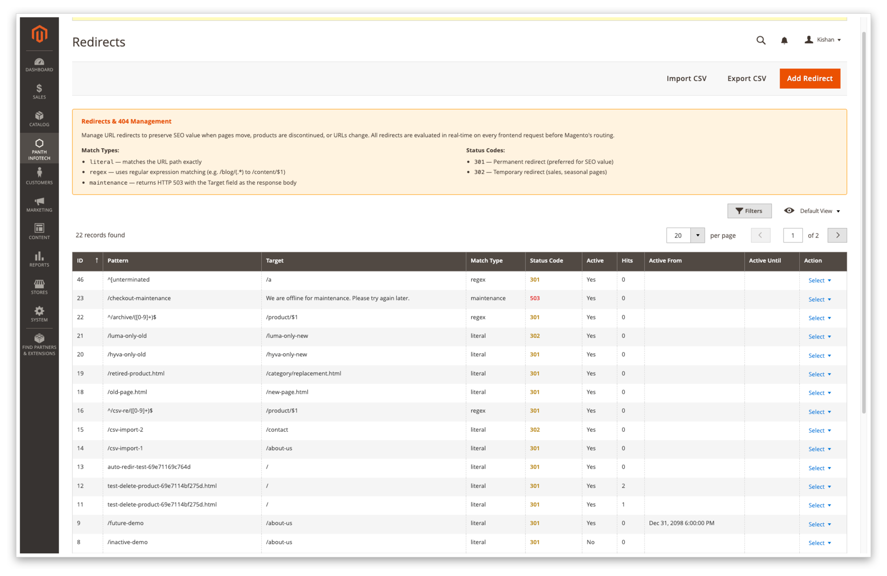
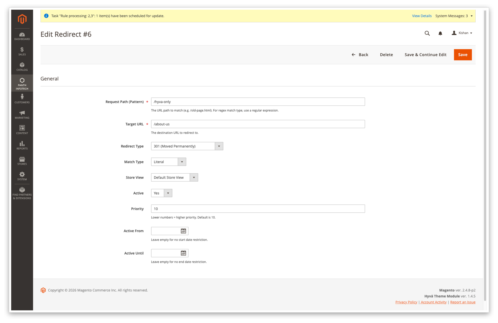
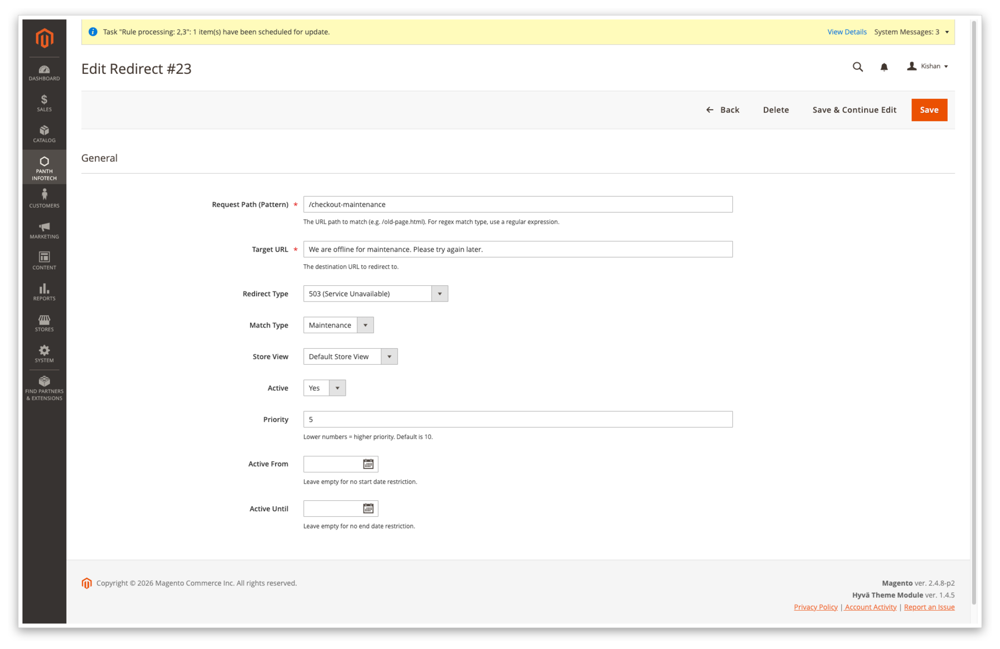
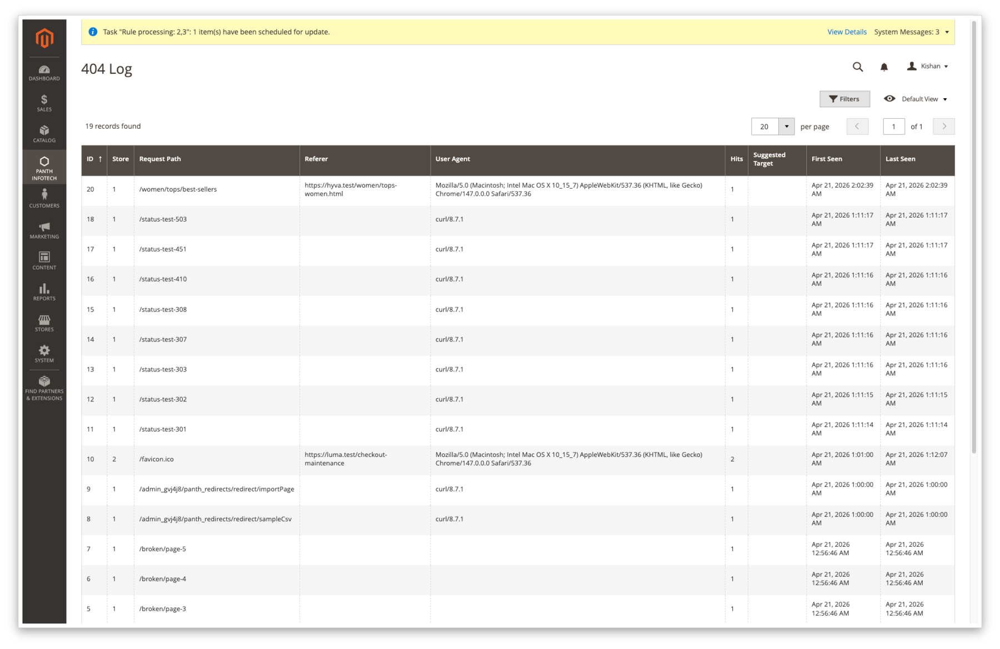
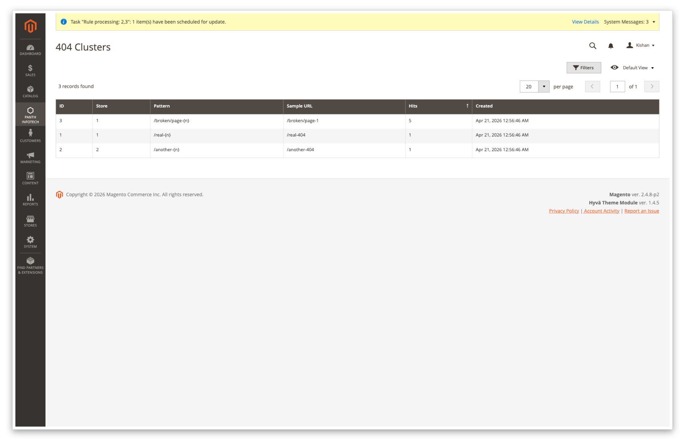
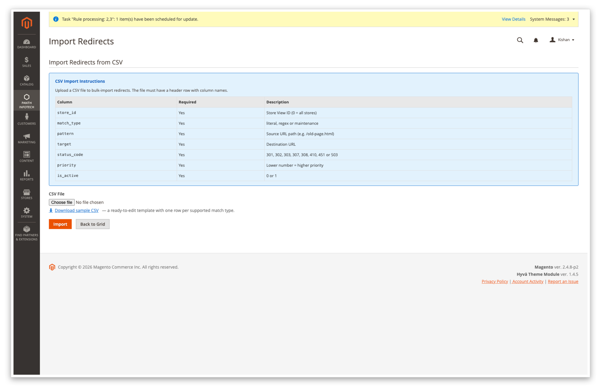

# Magento 2 Redirects

Panth Redirects adds a redirect manager and a 404 log to the Magento 2 admin. Magento's built-in URL rewrites only cover one exact request path per row and only for catalog and CMS entities that Magento itself knows about. This module stores its own rules in a separate table and evaluates them on every storefront GET request before the controller is dispatched, so it can match paths that no longer exist in Magento, match by regular expression, answer with status codes other than 301 and 302 (303, 307, 308, 410, 451, 503), limit a rule to a date window, and count how often each rule fires. It also creates redirects on its own when a product, category or CMS page is deleted, records every unmatched request in a 404 log, and groups those 404s into patterns once a day.

It is aimed at store owners and SEO teams who restructure catalogs, retire products or migrate from another platform, and at developers who need to load large sets of redirects from a CSV file. The module works at the request dispatch level and ships no frontend templates or assets, so it behaves the same on Hyva and Luma storefronts.

Product page: [kishansavaliya.com/magento-2-redirects.html](https://kishansavaliya.com/magento-2-redirects.html)



## Features

- Admin grid "Manage Redirects" with add, edit, delete, filtering, keyword search (pattern, target, match type), mass Delete, Enable and Disable actions, and "Import CSV" and "Export CSV" buttons. The 404 Log and 404 Clusters grids also have a keyword search (request path, referer, suggested target; pattern, sample URL).
- Three match types per rule: "Literal" (exact path), "Regex" (PCRE pattern with `$1`-style back-references in the target) and "Maintenance" (HTTP 503 with the target text as the response body).
- Eight status codes per rule: 301, 302, 303, 307, 308, 410, 451 and 503. Codes 410, 451 and 503 send the target text as the response body instead of a Location header.
- Per-rule store view scope (store view 0 = all store views), priority, active flag, "Active From" / "Active Until" window, hit counter and last-hit timestamp.
- Redirect loop detection for literal rules when saving in the admin and when importing.
- Automatic 301 redirects when a product, category or CMS page is deleted, targeting the parent category, the homepage or a configured custom path.
- Automatic 301 redirect from the old to the new request path when a product URL rewrite changes.
- Optional canonical redirects: uppercase paths to lowercase, homepage aliases (`/index.php`, `/home`, `/cms/index`, `/cms/index/index`) to the store base URL, and trailing slash removal.
- 404 log with request path, referer, user agent, hit count and first/last seen timestamps, de-duplicated per store view and path, with a per-IP rate limit.
- Daily 404 cluster job that groups the last seven days of logged 404s by a normalised pattern (digit runs replaced with `{n}`).
- Daily cleanup job that removes auto-generated rules whose "Active Until" date has passed or that were never hit within the configured number of days. Rules created in the admin or by import are never deleted by the job.
- CSV import and export from the admin, and a console command with a dry-run mode.
- Redirects are skipped for non-GET requests, XHR/JSON requests, admin, REST, SOAP, GraphQL, static and media paths.

## Compatibility

| Platform | Versions |
|---|---|
| Magento Open Source | 2.4.4 to 2.4.8 |
| Adobe Commerce | 2.4.4 to 2.4.8 |
| PHP | 8.1, 8.2, 8.3, 8.4 |

Composer constraints on Magento packages: `magento/framework ^103.0`, `magento/module-store ^101.0`, `magento/module-backend ^102.0`, `magento/module-catalog ^104.0`, `magento/module-cms ^104.0`, `magento/module-url-rewrite ^102.0`.

## Requirements

- Magento Open Source or Adobe Commerce 2.4.4 to 2.4.8.
- PHP 8.1, 8.2, 8.3 or 8.4 (`~8.1.0||~8.2.0||~8.3.0||~8.4.0`).
- `mage2kishan/module-core` `^1.0` (module `Panth_Core`), which provides the admin menu parent and the configuration tab this module attaches to. Composer installs it automatically.
- The Magento modules listed under Compatibility.
- The Magento cron must be running for the cleanup and 404 cluster jobs.

## Installation

```bash
composer require mage2kishan/module-redirects
bin/magento module:enable Panth_Core Panth_Redirects
bin/magento setup:upgrade
bin/magento setup:di:compile
bin/magento cache:flush
```

`setup:di:compile` is only needed in production mode. The module ships no files under `view/*/web`, so no static content deployment is required.

Check the result:

```bash
bin/magento module:status Panth_Redirects
```

## Configuration

Admin path: Stores > Configuration > Panth Infotech > Redirects & 404s. The tab (id `panth`) is registered by `Panth_Core`; the section itself belongs to this module and requires the ACL resource `Panth_Redirects::config`. All fields can be set at default, website and store view scope, except "Redirect Expiry Days" and "404 Logger Rate Limit (per second per IP)", which exist at default scope only. Values are read at store view scope.

### Group "Auto Redirect on Delete"

| Setting | Default | What it does |
|---|---|---|
| Enable Module | Yes | Master switch. When set to No, no rules are evaluated, no automatic redirects are created and no 404s are logged. |
| Auto-Create Redirect on Entity Delete | Yes | Creates a 301 rule when a product, category or CMS page is deleted. Shown when "Enable Module" is Yes. |
| Redirect Target Strategy | Parent Category | Where the automatic rule points for deleted products and categories: "Parent Category", "Homepage" or "Custom URL". Shown when "Auto-Create Redirect on Entity Delete" is Yes. |
| Custom Redirect URL | (empty) | Relative path used when the strategy is "Custom URL". Absolute URLs, protocol-relative URLs and `..` segments are rejected and the homepage is used instead. Shown when the strategy is "Custom URL". |
| Redirect Uppercase URLs to Lowercase | Yes | Sends a 301 from any path containing uppercase characters to the lowercase version. The query string is kept unchanged. Leading repeated slashes and backslashes are collapsed to a single `/` in the redirect target. |
| 301 Redirect Homepage Aliases to Root | Yes | Sends a 301 from `/index.php`, `/home`, `/cms/index` and `/cms/index/index` to the store base URL. |
| Remove Trailing Slash | No | Sends a 301 from paths ending in `/` to the same path without the slash. Leading repeated slashes and backslashes are collapsed to a single `/` in the redirect target. |
| Redirect Expiry Days | 365 | Auto-generated rules with zero hits that are older than this many days are deleted by the cleanup cron. A value of 0 or less falls back to 365. |

### Group "Regex Rule Matching"

| Setting | Default | What it does |
|---|---|---|
| Max Regex Rules Evaluated per Request | 0 | Upper bound on how many regex and maintenance rules are run for one request, counted after the text pre-filter described under "Order of matching". Rules after the limit are not evaluated and a warning is logged. 0 means no limit. |
| Regex Backtrack Limit | 0 | Value of `pcre.backtrack_limit` while rules are evaluated, restored afterwards. An expression that exceeds it counts as not matching. 0 keeps the PHP setting. |

Both fields exist at default scope only.

### Group "404 Logging"

| Setting | Default | What it does |
|---|---|---|
| Log 404s for Clustering | Yes | Records 404 responses in the 404 log table. |
| 404 Logger Rate Limit (per second per IP) | 10 | Maximum number of 404 log writes accepted per client IP per second. The client IP is taken from Magento's `RemoteAddress` service, so a forwarded-for header is only trusted when it is configured as an alternative header for that service (for example in `app/etc/di.xml` behind a proxy); otherwise `REMOTE_ADDR` is used. Uses APCu when available, otherwise a per-process counter. A value of 0 or less falls back to 10. |

Configuration paths:

- `panth_redirects/general/enabled`
- `panth_redirects/general/auto_redirect_enabled`
- `panth_redirects/general/redirect_target_strategy`
- `panth_redirects/general/redirect_custom_url`
- `panth_redirects/general/lowercase_redirect`
- `panth_redirects/general/homepage_redirect`
- `panth_redirects/general/remove_trailing_slash`
- `panth_redirects/general/expiry_days`
- `panth_redirects/general/match_original_uri` (default 1, no admin field; when set, a request whose routed path matched no rule is matched a second time against the original request URI)
- `panth_redirects/matching/regex_max_evaluations`
- `panth_redirects/matching/regex_backtrack_limit`
- `panth_redirects/logging/log_404`
- `panth_redirects/logging/rate_limit_per_second`

With the defaults, the module is active as soon as it is installed: rules are evaluated, deleted entities get a 301 rule, uppercase and homepage-alias redirects are on, trailing slash removal is off, and 404s are logged.

Admin menu entries, all under the "Panth Infotech" menu provided by `Panth_Core`:

- "Manage Redirects" (`panth_redirects/redirect/index`)
- "404 Log" (`panth_redirects/notfoundlog/index`)
- "404 Clusters" (`panth_redirects/notfoundcluster/index`)
- "Redirects Configuration" (opens the configuration section above)

## Usage

### Creating a redirect

Open "Manage Redirects" and click "Add Redirect". The form fields are:

- "Request Path (Pattern)": the path to match, for example `/old-page.html`. Required.
- "Target URL": the destination, or the response body for 410, 451, 503 and maintenance rules. Required. Targets starting with `javascript:`, `data:` or `vbscript:` are rejected.
- "Redirect Type": the HTTP status code (301 by default).
- "Match Type": "Literal", "Regex" or "Maintenance" ("Literal" by default).
- "Store View": a single store view, or "All Store Views" (store view 0).
- "Active": Yes/No.
- "Priority": lower numbers are evaluated first. Default 10.
- "Active From" and "Active Until": optional date and time window, evaluated in UTC. Leave both empty for a rule that is always active.



### Match types

- Literal: the request path is compared exactly after normalisation (query string removed, leading slash added, trailing slash removed). Example: pattern `/old-page.html`, target `/new-page.html`.
- Regex: the pattern is a PCRE expression. If it has no delimiters, it is wrapped in `~...~`. Captured groups can be used in the target. Example: pattern `^/archive/([0-9]+)$`, target `/product/$1`. A pattern that does not compile is logged and skipped.
- Maintenance: returns HTTP 503 with the header `Retry-After: 3600` and the "Target URL" text as a `text/plain` response body. The pattern of a maintenance rule is evaluated with the same regular-expression matching as a regex rule, so anchor it to limit it to one path. Example: pattern `^/checkout-maintenance$`, target `We are offline for maintenance. Please try again later.`



### Status codes

- 301, 302, 303, 307, 308: a Location header is sent with the target. A relative target is prefixed with `/` if needed. An absolute target is only followed when its host matches the base URL of one of the store views; other hosts are blocked and logged. Targets that start with `//` or contain a backslash or a control character are blocked and logged; this also applies to targets built from regex back-references. A redirect whose target equals the request path is ignored.
- 410, 451, 503: the status code is sent with the target text as a `text/plain` body and no Location header. 503 also sends `Retry-After: 3600`.

### Order of matching

For each storefront GET request the module:

1. Checks that the request is safe to redirect (see Developer Notes) and that "Enable Module" is Yes.
2. Loads the active rules for store view 0 plus the current store view, ordered by priority ascending and then by ID ascending.
3. Looks up the normalised request path among literal rules. When two literal rules have the same pattern, the one with the lowest priority value (then the lowest ID) wins, regardless of store view.
4. If no literal rule matched, tests the regex and maintenance rules in the same order and uses the first one that matches and is inside its date window. Each expression is compiled once when the rule table is built. Fixed text that every match must contain (a leading `^/prefix` or a literal run outside groups and classes) is extracted at the same time, and a rule whose fixed text is not in the request path is skipped without running the expression. Expressions with top-level alternation, inline options or the `x` modifier have no pre-filter and are always run.
5. If still nothing matched and `match_original_uri` is on, repeats steps 3 and 4 with the original request URI, which covers requests that Magento's own URL rewrites have already rewritten.
6. Sends the response, stops the controller from dispatching, and increments the rule's hit counter.

The canonical redirects (homepage aliases, lowercase, trailing slash) run as front controller plugins before the rule matching, in that order.

### Store scoping

A rule with "Store View" set to "All Store Views" applies everywhere; a rule with a specific store view applies only there. Rules for store view 0 and the current store view are merged before matching, so a store-specific rule does not automatically override a global rule with the same pattern; the priority decides.

### Automatic redirects

When "Auto-Create Redirect on Entity Delete" is Yes:

- Deleting a product creates one literal 301 rule per existing product URL rewrite (per store view) pointing to the first assigned category's URL in that store view, the homepage or the custom path, depending on "Redirect Target Strategy".
- Deleting a category creates one rule per category URL rewrite pointing to the parent category's URL, or to the homepage when the parent is a root category.
- Deleting a CMS page creates a rule from the page identifier to the homepage for each store view the page is assigned to. Pages with identifier `home` or `no-route` are skipped.

Redirects for changed product or category URL keys are left to Magento's own "Create Permanent Redirect for URLs if URL Key Changed" option.

### 404 log and turning a 404 into a redirect

Every request that ends in Magento's no-route handler and matches no redirect rule is written to the 404 log with the store view, path, referer, user agent and timestamps. Repeated hits on the same path in the same store view increment the "Hits" column rather than adding rows. The "404 Log" grid can be filtered and sorted by these columns.



To fix a logged 404, copy its "Request Path" into a new literal rule, or write a regex rule that covers a whole group. The "404 Clusters" grid shows the groups produced by the daily cluster job: the pattern (with digit runs replaced by `{n}`), the total hits and a sample URL. A cluster pattern such as `/catalog/product/view/id/{n}` can be turned into the regex rule `^/catalog/product/view/id/[0-9]+$`.



The "Suggested Target" column of the 404 log is kept for data created by earlier versions; this version does not fill it.

### Import and export

Open "Manage Redirects" and click "Import CSV". The page explains the format and offers a "Download sample CSV" link. The file must be a `.csv` of at most 10 MB with this header row (extra columns are ignored):

```csv
store_id,match_type,pattern,target,status_code,priority,is_active
0,literal,/old-page.html,/new-page.html,301,10,1
0,regex,^/archive/([0-9]+)$,/product/$1,301,30,1
0,maintenance,/checkout-maintenance,"We are offline for maintenance. Please try again later.",503,5,1
```

- `store_id`: store view ID, 0 for all store views.
- `match_type`: `literal`, `regex` or `maintenance`.
- `status_code`: one of 301, 302, 303, 307, 308, 410, 451, 503.
- `priority`: integer, lower runs first.
- `is_active`: 0 or 1.

Rows with an unknown match type or status code, an empty pattern or target, a target using a `javascript:`, `data:` or `vbscript:` scheme, a regex that does not compile, or a literal rule that would create a redirect loop are skipped and reported. Leading `=`, `+`, `-`, `@` and tab characters are stripped from pattern and target values, after removing a single leading apostrophe that precedes one of them. A valid row updates the existing rule with exactly the same store view and pattern (the lowest ID when several exist) and marks it as not auto-generated; otherwise it is inserted as a new rule. Importing the same file twice therefore leaves the rule table unchanged.



"Export CSV" downloads all rules of all store views, in the same column layout, ordered by ID. Grid filters are not applied to the export. Pattern and target values that start with `=`, `+`, `-`, `@`, tab or carriage return are prefixed with an apostrophe so spreadsheet programs do not evaluate them as formulas.

### Console command

```bash
bin/magento panth:redirects:import /path/to/redirects.csv
bin/magento panth:redirects:import /path/to/redirects.csv --dry-run
```

`--dry-run` validates the file and prints the counts and row errors without writing to the database.

### Cron jobs

| Job | Schedule | What it does |
|---|---|---|
| `panth_redirects_redirect_cleanup` | `0 4 * * *` (daily at 04:00) | Deletes auto-generated rules whose "Active Until" date is in the past, and auto-generated rules with zero hits created more than "Redirect Expiry Days" ago, then cleans the rule cache. |
| `panth_redirects_404_cluster` | `0 4 * * *` (daily at 04:00) | Reads up to 500 of the most-hit 404 log rows seen in the last 7 days, groups them by normalised pattern and store view, and replaces the contents of the cluster table. |

Rules created in the admin or by import are never deleted by the cleanup job. Once their "Active Until" date has passed they simply stop matching and stay in the grid.

### Caching

The compiled rule table for each store view is stored in the Magento cache for 3600 seconds under the tag `panth_redirects_table`. The module cleans that tag when a rule is saved or deleted in the admin, when a CSV import (admin or console, not dry-run) adds at least one row, when an automatic redirect is created on entity delete, and when the cleanup cron deletes at least one rule. Other changes, such as direct database edits, take up to an hour to show on the storefront unless that tag is cleaned.

Redirect rules are evaluated only on requests that reach PHP. A page already served from Varnish or the built-in full page cache is not re-evaluated until it expires or is invalidated. The homepage alias redirect sets no-cache headers on its response.

## Developer Notes

- Module name: `Panth_Redirects`; Composer package: `mage2kishan/module-redirects`; namespace: `Panth\Redirects`; version 1.2.1.
- `mage2kishan/module-advanced-seo` lists this package as a suggested package in its `composer.json`; it does not require it. The tables are named `panth_seo_*` on purpose so that data created by the earlier `Panth_AdvancedSEO` module is kept when this module is installed on an upgraded site.
- `Panth\Redirects\Api\RedirectMatcherInterface` (preference: `Model\Redirect\Matcher`) exposes `match(string $requestPath, int $storeId)`, `recordHit(int $redirectId)` and `log404(...)`. `Api\Data\RedirectRuleInterface` describes a rule row.
- `Observer\Redirect\Predispatch` (event `controller_action_predispatch`, frontend area) performs the matching and sends the response. `Service\RedirectGuard::isSafeToRedirect()` allows only GET requests, rejects XHR/JSON/non-navigate requests and admin URLs, requires the frontend area, and skips paths starting with `/rest/`, `/soap/`, `/graphql`, `/V1/`, `/static/`, `/media/`, `/pub/`, `/errors/`, `/health_check`, `/sitemap`, `/robots.txt` and `/favicon.ico`.
- Frontend-only plugins (`etc/frontend/di.xml`): `HomepageRedirectPlugin`, `LowercaseRedirectPlugin` and `TrailingSlashRedirectPlugin` around `FrontControllerInterface::dispatch`; `NoRouteLoggerPlugin` after `Router\NoRouteHandler::process`; `UrlRewrite\RouterXhrGuard` around `Magento\UrlRewrite\Controller\Router::match`, which returns null (no core URL rewrite redirect) for requests the guard considers unsafe.
- Observers: `ProductDeleteBefore`, `CategoryDeleteBefore`, `CmsPageDeleteBefore` on `model_delete_before` (global).
- Other classes: `Model\Redirect\ImportExport` (CSV), `Model\Redirect\Loop` (loop detection for literal rules, depth 25), `Model\Redirect\AutoRedirectService`, `Model\Redirect\NotFoundLogger`, `Model\Redirect\PathNormalizer`, `Model\Redirect\RegexPrefilter`, `Cron\RedirectCleanup`, `Cron\NotFoundCluster`, `Console\Command\RedirectImportCommand`.
- ACL resources: `Panth_Redirects::manage` ("Redirects and 404s") with children `Panth_Redirects::redirects` ("Manage Redirects"), `Panth_Redirects::not_found_log` ("404 Log"), `Panth_Redirects::not_found_cluster` ("404 Clusters"); and `Panth_Redirects::config` ("Panth Redirects Configuration") under Stores > Configuration.
- Admin route: `panth_redirects` (controllers under `Controller/Adminhtml/Redirect`, `NotFoundLog`, `NotFoundCluster`). UI components: `panth_redirects_redirect_listing`, `panth_redirects_redirect_form`, `panth_redirects_notfoundlog_listing`, `panth_redirects_notfoundcluster_listing`.
- Database tables (`etc/db_schema.xml`): `panth_seo_redirect` (rules, foreign key to `store` with cascade delete), `panth_seo_404_log` (unique per `store_id` + `path_hash`), `panth_seo_404_cluster` (foreign key to `store` with cascade delete).
- Unit tests under `Test/Unit` cover `PathNormalizer`, `RegexPrefilter` and the `Predispatch` observer.

## Uninstallation

```bash
bin/magento module:disable Panth_Redirects
composer remove mage2kishan/module-redirects
bin/magento setup:upgrade
bin/magento setup:di:compile
bin/magento cache:flush
```

The tables `panth_seo_redirect`, `panth_seo_404_log` and `panth_seo_404_cluster` and the configuration values under `panth_redirects/*` in `core_config_data` are not removed by these steps. Drop them manually if they are no longer needed. Keep the tables if `mage2kishan/module-advanced-seo` or the earlier `Panth_AdvancedSEO` module is still installed.

## Support

- Product page: [kishansavaliya.com/magento-2-redirects.html](https://kishansavaliya.com/magento-2-redirects.html)
- Contact form: [kishansavaliya.com/contact](https://kishansavaliya.com/contact)
- Email: kishansavaliyakb@gmail.com
- Bug reports: [GitHub issues](https://github.com/mage2sk/module-redirects/issues)

## License

Proprietary, as declared in `composer.json`. The package is published on Packagist and can be installed with Composer; see the product page for the terms of use.

## Changelog

See [CHANGELOG.md](CHANGELOG.md).

## Links

- Website: [kishansavaliya.com](https://kishansavaliya.com)
- All extensions: [kishansavaliya.com/magento-extensions.html](https://kishansavaliya.com/magento-extensions.html)
- GitHub: [github.com/mage2sk/module-redirects](https://github.com/mage2sk/module-redirects)
- Packagist: [packagist.org/packages/mage2kishan/module-redirects](https://packagist.org/packages/mage2kishan/module-redirects)
